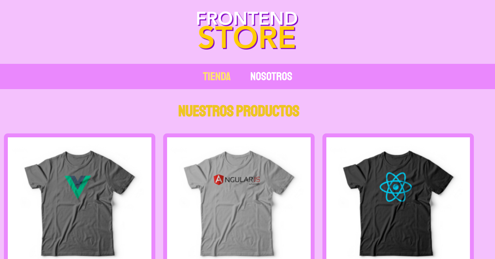
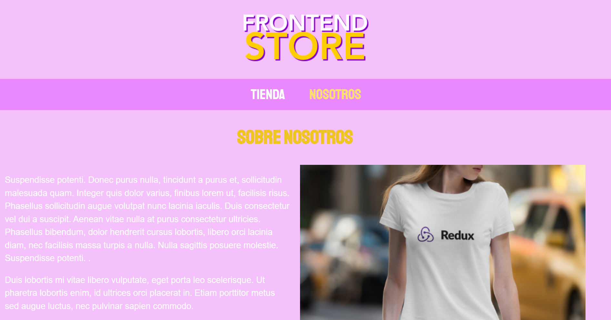
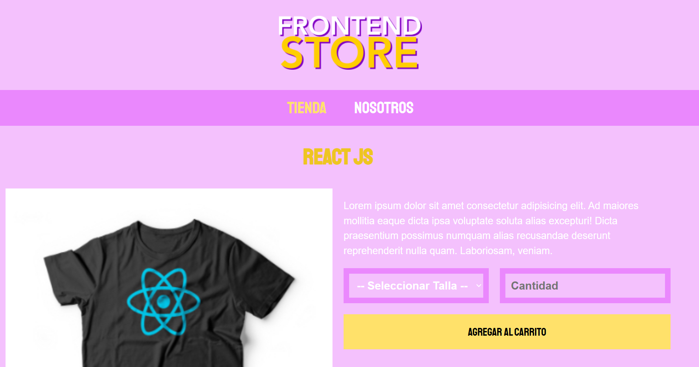

# Tienda de Camisetas - FrontEnd Store

Proyecto frontend de una tienda de camisetas. Incluye catálogo de camisetas, descripción sobre la tienda, página con descripción de las características del producto, carrito (simulado) y diseño responsive.

**Demo:** https://nqingstore.netlify.app/

## Vista previa

## Tecnologías

- HTML5
- CSS3 (Grid, Flexbox)
- Responsive Design

## Características

- Catálogo de productos
- Página de detalle
- Formulario de compra
- Animaciones y transiciones
- Totalmente responsive
